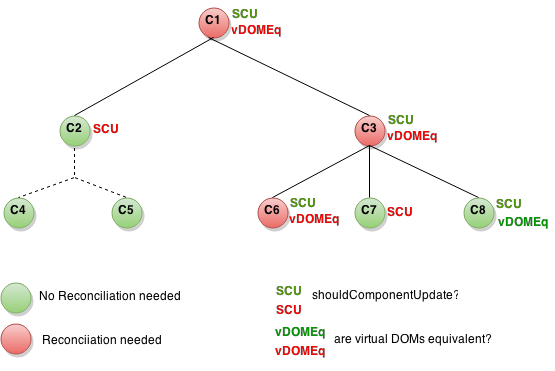

# 高级性能 

人们首先会考虑的是 React 是能否和其他非 React 版本一样能快速和响应一个项目。重新绘制组件的整个子树来回应每一个状态变化的想法让人怀疑是否这个过程中对性能产生负面影响。React 使用几个巧妙的技巧，以减少所需的更新用户界面所需要的昂贵的文档用户模型操作的数目。 

## 避免调和文档对象模型 

React 使用了一个*虚拟的 DOM*，这是的浏览器中对于 DOM 树呈现的一个描述符。这种并行表示形式让 React 避免产生 DOM 节点和访问现有的节点，比 JavaScript 对象的操作速度较慢。当一个组件的道具或状态改变，React 决定通过构建一个新的虚拟 DOM 来进行实际的 DOM 更新和旧的 DOM 相比是否必要。只有在比较结果不一样的情况下，Reac t尽可能少的应用转变来融合文档对象模型。 

在此之上，React 提供了一个组件的生命周期功能，`shouldComponentUpdate`，这是在重新绘制过程开始之前触发（虚拟 DOM 比较，可能最终调和 DOM），使开发人员能够减少过程中的循环步骤。这个函数的默认实现返回 `true`，让 React 来执行更新：

``` 
shouldComponentUpdate: function(nextProps, nextState) {
  return true;
}
```

请记住，React 将非常频繁的调用这个函数，所以实现必须要快。
比如说你有一个由几个聊天线程组成的消息应用程序。假设只有一个线程已经改变。如果我们在 `ChatThread` 上执行 `shouldComponentUpdate`，React 可以为其他线程跳过描绘步骤：

``` 
shouldComponentUpdate: function(nextProps, nextState) {
  // TODO: return whether or not current chat thread is
  // different to former one.
} 
```

因此，简言之，React 避免调和 DOM 产生的复杂的 DOM 操作，允许用户使用 `shouldComponentUpdate` 缩短过程中的循环步骤，而且，对于那些需要更新，通过对比虚拟的 DOM 来实现。

## 起作用的 shouldComponentUpdate

下面是组件的子树。对于每一个组件表示 `shouldComponentUpdate` 的返回值，以及是否与虚拟的 DOM 是等价的。最后，圆的颜色指示组件是否必须调和。




在上面的例子中，由于 `shouldComponentUpdate` 返回值为 `false`，存在 C2 中，React 没有必要产生新的虚拟的 DOM，并且因此，也不需要调和 DOM。需要注意的是 react 甚至没有在 C4 和 C5 处调用 `shouldComponentUpdate`。 

对于 C1 和 C3 `shouldComponentUpdate` 返回 `true`，所以 React 不得不深入到叶子节点并且进行检查。 

对于 C6 它返回 `true`；由于和虚拟的 DOM 并不等同，它不得不调和 DOM。最后一个有趣的例子是 C8。此节点的 React 必须计算虚拟 DOM，但因为它和原来的 DOM 相同，它不需要调和 DOM。 

请注意，只有 C6 需要 React 不得不对 DOM 做转变，这是不可避免的。对于 C8 通过比较虚拟的 DOM 他不需要转变，但是对 C2 的子树和 C7来说，它甚至没有计算虚拟 DOM，只需要通过执行 `shouldComponentUpdate`。 

所以，我们应该如何执行 `shouldComponentUpdate` 呢？比如现有一个仅需呈现一个字符串值的组件：

``` 
React.createClass({
  propsTypes: {
    value: React.PropTypes.string.isRequired
  },
  render: function() {
    return <div>this.props.value</div>;
  }
});
``` 

我们可以很容易地实现 `shouldComponentUpdate`，如下： 

``` 
shouldComponentUpdate: function(nextProps, nextState) {
  return this.props.value !== nextProps.value;
}
```

到目前为止，React 处理这类简单的道具/态结构非常简单。我们甚至可以泛化一个基于浅层相等实现，并混合到组件上。事实上，React 已经提供了这样实现：[PureRenderMixin](http://facebook.github.io/react/docs/pure-render-mixin.html)。 

但如果你的组件的道具或状态是可变的数据结构呢？比如说组件接受的道具，而不是像`'bar'`的这样的字符串，而是一个是包含，如，`{FOO：'bar'}`这样一个字符串的 JavaScript 对象：

``` 
React.createClass({
  propsTypes: {
    value: React.PropTypes.object.isRequired
  },
  render: function() {
    return <div>this.props.value.foo</div>;
  }
}); 
``` 

我们之前的 `shouldComponentUpdate` 实现总是不会如我们预期一样的实现： 

``` 
/ assume this.props.value is { foo: 'bar' }
// assume nextProps.value is { foo: 'bar' },
// but this reference is different to this.props.value
this.props.value !== nextProps.value; // true
```

问题是当道具实际上并没有改变时，`shouldComponentUpdate` 将返回 `true`。为了解决这个问题，我们可以用这个替代的试行方案：

```
shouldComponentUpdate: function(nextProps, nextState) {
  return this.props.value.foo !== nextProps.value.foo;
}
```

基本上，我们为确保我们正确地跟踪变化，最后做了深刻的对比。这种做法是在性能方面相当昂贵和复杂的，它并不能扩展，因为我们要为每个模型写不同的深度相等代码。最重要的是，如果我们不小心管理对象的引用，它甚至可能没有工作。比如说母节点组件的引用：

``` 
React.createClass({
  getInitialState: function() {
    return { value: { foo: 'bar' } };
  },
  onClick: function() {
    var value = this.state.value;
    value.foo += 'bar'; // ANTI-PATTERN!
    this.setState({ value: value });
  },
  render: function() {
    return (
      <div>
        <InnerComponent value={this.state.value} />
        <a onClick={this.onClick}>Click me</a>
      </div>
    );
  }
});
``` 

在第一时间内部组件得到呈现是 `{FOO：'bar'}`，它将作为道具的值。如果用户点击，母组件的状态将得到更新为 `{value：{FOO：'barbar'}}`，引发了内部部件在过程中重新呈现，将接收 `{foo：“barbar'}` 为道具的新值。

问题是，由于母体和内部部件共享一个参考同一个对象，当对象在第二行的 `onClick` 功能函数中突变时，道具的内部部件具有将发生变化。这样，当再描绘处理开始时，`shouldComponentUpdate`被调用，`this.props.value.foo` 将等于 `nextProps.value.foo`，因为事实上，`this.props.value` 和 `nextProps.value`引用相同的对象。

因此，由于我们错过了道具和缩短步骤重新渲染过程中的变化，用户界面将不会得到从 `'bar'` 到 `'barbar'` 的更新。

## Immutable-JS 救援
[Immutable-JS](https://github.com/facebook/immutable-js) 是 Lee Byron 写的脚本语言集合库，其中 Facebook 最近开源 Javascript 的集合库。它提供了通过结构性共享一成不变持久化集合。让我们看看这些性能：

- *不可变的*：一旦创建，集合不能在另一个时间点改变。
- *持久性*：新的集合可以由从早先的集合和突变结合创建。在创建新的集合后，原来集合仍然有效。
- *结构共享*：使用新的集合创建为与对原始集合大致相同的结构，减少了拷贝的最低限度，以实现空间效率和可接受的性能。如果新的集合等于原始的集合，则通常会返回原来的集合。 

不变性使得跟踪更改方便;而变化将总是产生在新的对象，所以我们只需要检查的已经改变参考对象。例如，在这个 Javascript 代码中：

``` 
var x = { foo: "bar" };
var y = x;
y.foo = "baz";
x === y; // true
```

虽然 `y` 被修改了，但因为它是对相同对象 `x` 的引用，所以这个比较返回 `true`。然而，这段代码可以用 immutable-JS 这样写：

``` 
var SomeRecord = Immutable.Record({ foo: null });
var x = new SomeRecord({ foo: 'bar'  });
var y = x.set('foo', 'baz');
x === y; // false
``` 

在这种情况下，由于 `x` 突变，当一个新的引用被返回，我们可以安全地假设 `x` 已经改变。 

另一种跟踪变化的可能的方法是通过设置标志来做 dirty 检查。这种方法的一个问题是，它迫使你使用 setter 或者写很多额外的代码，或某种类工具。或者，你可以突变之前深入对象复制并深入比较，以确定是否有变化。这种方法的一个问题是 deepCopy 和 deepCompare 是耗费大且复杂的操作。 

因此，不可变的数据结构为您提供了一种廉价和更简洁的方式来跟踪对象的变化，这就是我们为了实现 `shouldComponentUpdate` 所需要的。因此，如果我们利用 immutable-JS 提供的抽象特性来支持和声明属性，我们就可以使用 `PureRenderMixin` 并获得 perf 的一个很好的推动。 

## Immutable-JS 和通量 

如果你使用[通量](http://facebook.github.io/flux/)，你应该开始使用 immutable-JS 写你的库。看看[完整的 API](http://facebook.github.io/immutable-js/docs/#/)。

让我们来看看使用不可变的数据结构来模拟线程的一种可行的办法。首先，我们需要为每一个我们正在尝试模拟的实体定义一个 `record` 。记录是不可变的容器，为一组特定的域保存值：

``` 
var User = Immutable.Record({
  id: undefined,
  name: undefined,
  email: undefined
});
var Message = Immutable.Record({
  timestamp: new Date(),
  sender: undefined,
  text: ''
});
``` 

`Record` 函数接收的对象定义了对象的域和它们的默认值。

消息*库*可以使用以下两个列表来跟踪用户和信息：

``` 
this.users = Immutable.List();
this.messages = Immutable.List();
``` 

实现处理每个*负载*类型的功能应该是相当容易的。例如，当库看到负载正在显示一个新的消息，我们只要创建一个新的记录，并把它添加到消息列表中：

``` 
this.messages = this.messages.push(new Message({
  timestamp: payload.timestamp,
  sender: payload.sender,
  text: payload.text
});
```

请注意，由于数据结构是不可改变的，我们需要把推送功能的结果分配到 this.messages 中。
 
在 React 中，如果我们也使用 immutable-JS 数据结构来保存组件的状态下，我们可以混合 `PureRenderMixin` 到所有的组件，并且缩短重新呈现的过程。


